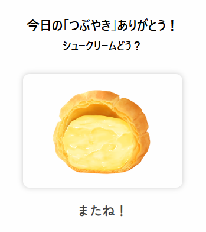
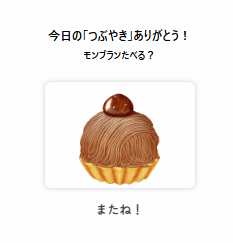

# 就労支援A型事業所向け「つぶやきアプリ」

> 今日の思いを、ひと粒ずつ、ことばの形に残す。

---

## ※ 目的

このアプリは、就労支援A型事業所におけるスタッフの小さな気づきや感情を「つぶやき」として記録し、働く日々を可視化することで、前向きな出勤意識の醸成をサポートします。

> データとは、ひとの営み。
> 小さなつぶやきを集めて見える化することで、ちいさなDXを推進します。

---

## ※ 狙いと効果

* 出勤率の向上（＝助成金収入の加算）
* 就労者の自己理解・達成感・自己効力感の向上
* 職員による現状把握、報告資料作成用キーワードの蓄積

### 背景

A型事業における給付費（助成金）は、出勤率・労働時間・支援内容などによって決まります。
令和6年度スコア表では特に「出勤率」「労働時間」に改善余地があるとされ、
本アプリは就労者自身の自己内省を促し、職員の業務負担を軽減する仕組みとして開発されました。

---

## ※ アプリ構成

以下の画面とテンプレートファイルで構成されています。

| URLパス       | テンプレートファイル        | 機能概要                 |
| ----------- | ----------------- | -------------------- |
| `/login`    | `login.html`      | ログイン画面（スタッフNo・名前を入力） |
| `/register` | `register.html`   | 新規ユーザー登録画面           |
| `/form`     | `tsubutsubu.html` | 業務チェック＋コメント記入        |
| `/thanks`   | `thanks.html`     | ランダムなお菓子画像と励ましの表示    |
| `/mypage`   | `mypage.html`     | マイページにて自身のコメント表示    |

### データファイル

* `users.csv`：ログイン情報・ユーザー管理用
* `records.csv`：つぶやき等の入力記録
* `static/images/`：イラスト画像保存用ディレクトリ

---

## ※ 技術スタック

* Python / Flask
* HTML / CSS / Jinja2

---

## ※ 対象ユーザー

* 就労継続支援A型事業所の利用者
* 支援員、管理者、事業所運営者
* 補助金報告書・支援記録作成の実務担当者

---

## ※ スクリーンショット

□ ログイン画面：やさしい配色とひよこのアイコンで直感的操作

  

    

    
<strong>ログイン画面</strong> シンプルな入力欄とかわいいアイコン

  

  

     
    
<strong>新規登録画面</strong> IDとパスワードを登録して開始

  

 

□ 入力画面：「つぶつぶ」を残すシンプルなデザイン

  

     
    
<strong>業務を選択して入力</strong> 気づきと反省を自由に記録できます

  

## ※ スクリーンショット

□ 完了画面：お菓子の画像と一言で、小さなごほうび

  

     
    
<strong>今日の「つぶやき」ありがとう！</strong> シュークリームどう？ またね！

  

  

     
    
<strong>今日の「つぶやき」ありがとう！</strong> モンブランいかが？ またね！

  
 

---
## ※ このアプリについて
このアプリは、「Python+Javaプログラマー養成講座」の卒業課題として制作しました。

